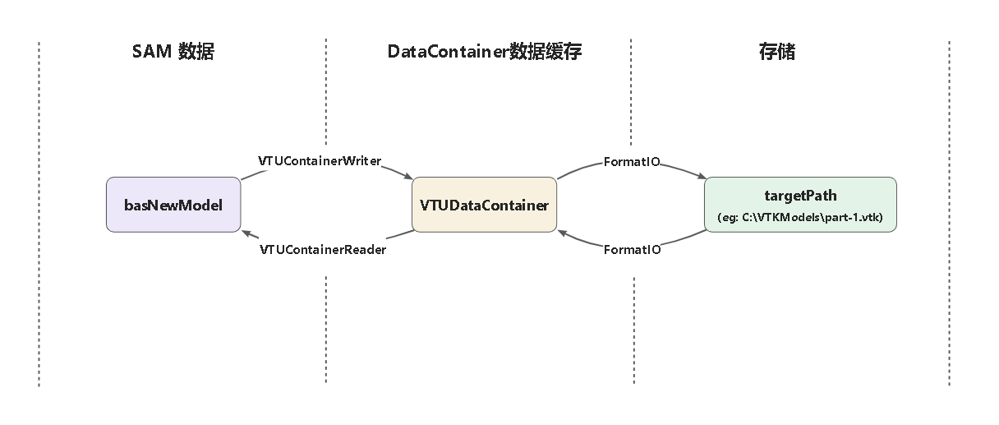
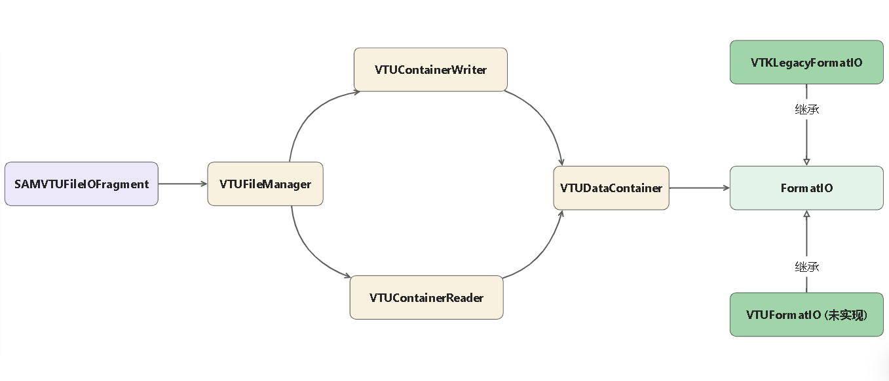

# VTKFileIO详细设计

## 模块功能说明

### 数据流视图



### 类视图



### 功能模块说明
<li><b>VTKFileIO</b>
        <ul style="list-style-type: disc;">
          <li>SAMVTKFileIOFragment
            <ul style="list-style-type: none;">
              <li>ptsKModelFragment继承类，接收Gui端的读写VTK命令
              </li>
            </ul>
          <li>VTUElementHandler
            <ul style="list-style-type: none;">
              <li>定义SAM单元类型与VTK单元类型的转换，定义单元对应的顶点数据长度
              </li>
            </ul>
          <li>VTUFileManager
            <ul style="list-style-type: none;">
              <li>数据中转站，调用方法将 SAM 或 VTK 数据转换为 DataContainer
              </li>
            </ul>
          <li>VTUDataContainer
            <ul style="list-style-type: none;">
              <li>缓存中转数据
              </li>
            </ul>
          <li>VTUContainerWriter
            <ul style="list-style-type: none;">
              <li>将 SAM 数据写入 DataContainer 数据缓存类的方法
              </li>
            </ul>
          <li>VTUContainerReader
            <ul style="list-style-type: none;">
              <li>将 DataContainer 数据读入 SAM 的方法
              </li>
            </ul>
          <li>FormatIO
            <ul style="list-style-type: none;">
              <li>DataContainer 缓存数据写入存储和从存储读出的模板类
              </li>
            </ul>
          <li>VTKLegacyFormatIO
            <ul style="list-style-type: none;">
              <li>FormatIO的实现类，是VTK Legacy文件的读写方法
              </li>
            </ul>
          <li>MessageHandler
            <ul style="list-style-type: none;">
              <li>负责向 Message 消息窗口发送模块工作状态信息，包括报错已经导入导出时读取到的节点、单元数量
              </li>
            </ul>
          <li>VTUFileIOPytMoudle
          <li>VTUIOUtils</li>
        </ul>
      </li>

## Export 导出功能详细设计

[Export Classes View](./pictures/ExportClassView.png)

模块的主要功能包括： 
+ 菜单栏按钮插入，在`VTKFileIOToolset`实现：

	```cpp
	//VTKFileIOToolset.cpp

	SAMMenuCommand* exportVTKCmd = new SAMMenuCommand(this, fileMenu, tr("&VTK Legacy.."));
	testMenu->addAction(exportVTKCmd);
	```


+ 读取输出位置、场景(**Part**、**Assembly**、**Visualization**)以及模型名字等，确定数据输出范围。在不同视图下输出VTK文件包含的内容如下表：

    |场景|输出范围|
    |:--------|:--------|
    |**Part**|**Part**|
    |**Assembly**|所有**Part**|
    |**Visualization**|所有**Part** + 后处理数据|

	```cpp
	//VTUFileIOCommand.cpp
	const sesGVpContext& context = sesGSessionState::Instance()->ConstGetVpContext();

	omuArguments args(4);
	args.Put(path);
	args.Put((int)(context.TypeByModule()));
	args.Put(context.ModelName());
	args.Put(context.PartName());

	//VTUFileManager.cpp
	//区分场景输出对应文件
	int VTUFileManager::WriteCache() {
		writer = new VTUContainerWriter();
		switch (target.displayMode) {
			case omu_PART: {
				return writeSinglePart();
			}
			case omu_ASSEMBLY: {
				return writeAllParts();
			}
			case omu_ODB: {
				return writeODB();
			}
		}
		return ERRORTYPE_WRONG_SCENE;
	}
	```

+ 读取点和单元数据:

	```cpp
	int VTUFileWriter::GetVTKPart(){
    	ftrFeatureList* flpart = part.GetFeatureList();
    	const bmeMesh* objectMesh = flpart->ConstGetMesh(bdoDefaultInstId);
		const bmeNodeData& nodeData = objectMesh->NodeData();
	}
	```

+ 定义 SAM 单元类型和 VTK 单元类型的转换

	```cpp
	//VTUElementHandler.h
	class VTUElementHandler
	{
	public:
		static enum VTKType {
			VTK_NONE,
			VTK_VERTEX,
			VTK_POLYVERTEX,
			VTK_LINE,
			VTK_POLY_LINE,
			VTK_TRIANGLE,
			VTK_TRIANGLE_STRIP,
			VTK_POLYGON,
			VTK_PIXEL,
			VTK_QUAD,
			VTK_TETRA,
			VTK_VOXEL,
			VTK_HEXAHEDRON
		};

	public:
		static VTKType SimplifiedConvertor(const QString& typeLabel, int dimension);

		static VTKType ConvertTo1DVTKType(const QString& typeLabel);

		static VTKType SimplyConvertTo1DVTKType(const QString& typeLabel);
		static VTKType SimplyConvertTo2DVTKType(const QString& typeLabel);
		static VTKType SimplyConvertTo3DVTKType(const QString& typeLabel);

		static bool Check3DVTKType(VTUElementHandler::VTKType type);

		static int GetArrayLengthByLabel(const QString& typeLabel);
		static int GetArrayLengthByEnum(VTKType typeEnum);

		static bool IsCube(VTKType typeEnum);

		static QString GetSAMTypeByVTKType(VTKType typeEnum, int beamType = 0, int cubeType = 0, int quadType = 0);
	};
	```

+ 将转换的 SAM 数据写入缓存:

	```cpp
	int VTUFileManager::WriteCache() {
	
	writer = new VTUFormatWriter();
	switch (target.displayMode) {
		case omu_PART: {
			return writeSinglePart();
		}
		case omu_ASSEMBLY: {
			return writeAllParts();
		}
		case omu_ODB: {
			return writeODB();
		}
	}
	return ERRORTYPE_WRONGSCENE;
	}
	```

+ 写出VTK文件：

	```cpp
	int VTKLegacyFormatWriter::Write() {
		if (!file) return ERRORTYPE_NOTEXIST;
		*stream << "# vtk DataFile Version 3.0\n";
		*stream << "SAMModel Output" << "\n";
		*stream << "ASCII\n";
		*stream << "DATASET UNSTRUCTURED_GRID\n";
		*stream << flush;

		currentState = HeaderWritten;
		currentState = WritePointsHeader();
		*stream << flush;

		currentState = WritePoints();
		*stream << flush;

		currentState = WriteCellsHeader();
		*stream << flush;

		currentState = WriteCells();
		*stream << flush;

		currentState = WriteCellTypesHeader();
		*stream << flush;

		currentState = WriteCellTypes();
		*stream << flush;

		return 0;
	}
	```

## Import导入详细设计

[Import Classes View](./pictures/ExportClassView.png)

+ VTK Legacy 格式读入至数据缓存 DataContainer

	```cpp
	int VTKLegacyFormatReader::Read() {

		if (!file) return ERRORTYPE_NOTEXIST;

		if (stream->atEnd()) return ERRORTYPE_FILE_READ_FAILED;
		QString versionLine = stream->readLine();
		if (!versionLine.startsWith("# vtk DataFile Version")) {
			return ERRORTYPE_FILE_READ_FAILED;
		}

		// Comment line (skip)
		if (stream->atEnd()) return ERRORTYPE_FILE_READ_FAILED;

		stream->readLine();

		// Format (only ASCII supported)
		if (stream->atEnd()) return ERRORTYPE_FILE_READ_FAILED;
		QString format = stream->readLine().trimmed();
		if (format != "ASCII") {
			return ERRORTYPE_FILE_READ_FAILED;
		}

		// Dataset type
		if (stream->atEnd()) return ERRORTYPE_FILE_READ_FAILED;
		QString dataset = stream->readLine().trimmed();
		if (!dataset.startsWith("DATASET UNSTRUCTURED_GRID")) {
			return ERRORTYPE_FILE_READ_FAILED;
		}
		QString version = versionLine.split(' ', QString::SkipEmptyParts)[4];
		if (version == "3.0")
			return Read30();
		else if (version == "5.1")
			return Read51();
		else
			return ERRORTYPE_FILE_READ_FAILED;
	}
	```
+ 