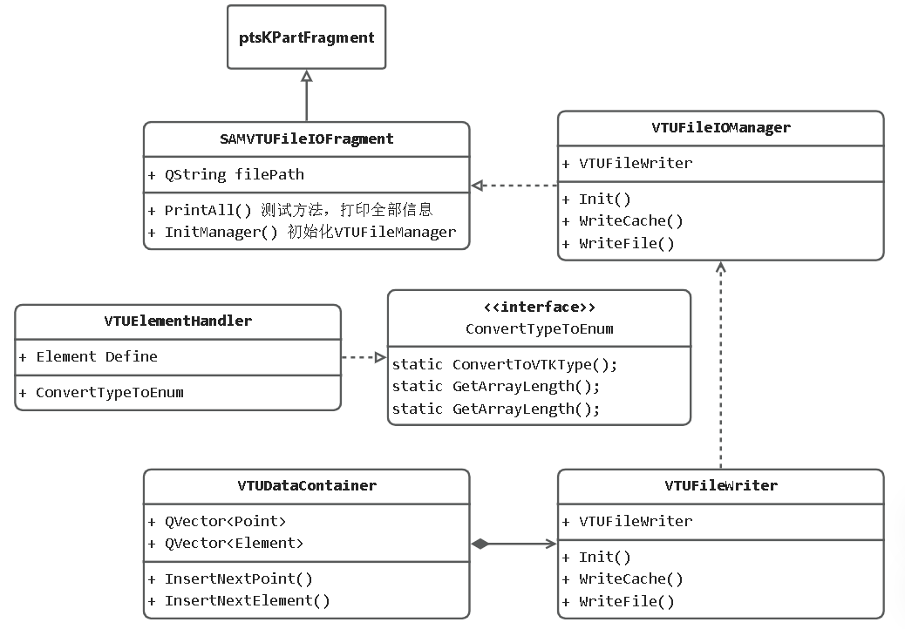

# VTKFileIO详细设计
## Export导出详细设计



模块的功能包括： 
+ 菜单栏按钮插入，在`VTKFileIOToolset`实现：

	```cpp
	//VTKFileIOToolset.cpp

	SAMMenuCommand* exportVTKCmd = new SAMMenuCommand(this, fileMenu, tr("&VTK Legacy.."));
	testMenu->addAction(exportVTKCmd);
	```


+ 读取场景(**Part**、**Assembly**、**Visualization**),确定数据输出范围。在不同视图下输出VTK文件包含的内容如下表：

    |场景|输出范围|
    |:--------|:--------|
    |**Part**|**Part**|
    |**Assembly**|所有**Part**|
    |**Visualization**|所有**Part** + 后处理数据|

	```cpp
	//SAMVTKFileIOFragment.cpp

	class omuPrimtive;
	omuPrimtive SAMSceneMethod::method{
		{"Part",VTKFileManager::ReadPart},
		{"Assembly",VTKFileManager::ReadAllParts},
		{"Visualization",VTKFileManager::ReadAll}
	}
	```

+ 读取点和单元数据:

	```cpp
	int VTUFileWriter::GetVTKPart(){
    	ftrFeatureList* flpart = part.GetFeatureList();
    	const bmeMesh* objectMesh = flpart->ConstGetMesh(bdoDefaultInstId);
		const bmeNodeData& nodeData = objectMesh->NodeData();
	}
	```

+ 定义单元的枚举类型和VTK单元类型的转换

	```cpp
	#define VTK_LINE 3
	#define VTK_TRIANGLE 5
	#define VTK_QUAD 9

	class VTUElementHandler
	{
	public:
		static int ConvertToVTKType(const QString& typeLabel);
		static int GetArrayLength(const QString& typeLabel);
		static int GetArrayLength(const int& typeEnum);
	};
	```

+ 将转换的 SAM 数据写入缓存:

	```cpp
	int VTUFileManager::WriteCache() {
	
	writer = new VTUFormatWriter();
	switch (target.displayMode) {
		case omu_PART: {
			return writeSinglePart();
		}
		case omu_ASSEMBLY: {
			return writeAllParts();
		}
		case omu_ODB: {
			return writeODB();
		}
	}
	return ERRORTYPE_WRONGSCENE;
	}
	```

+ 写出VTK文件：

	```cpp
	//TODO
	```

## Import导入详细设计
