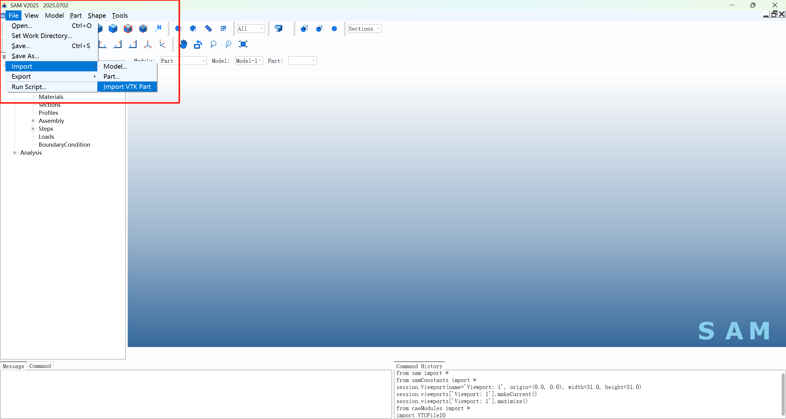
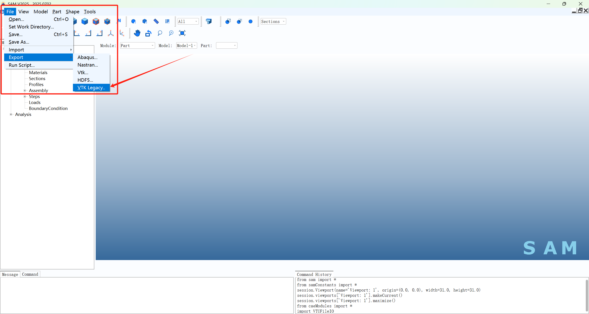
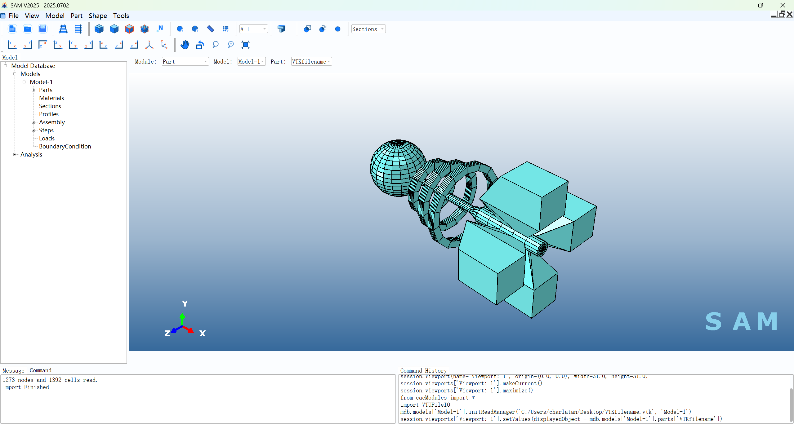
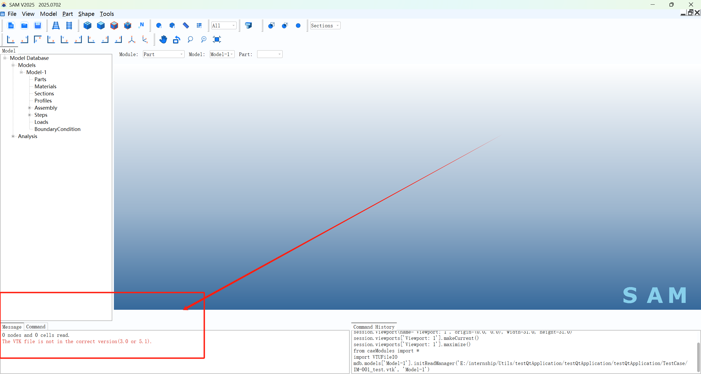
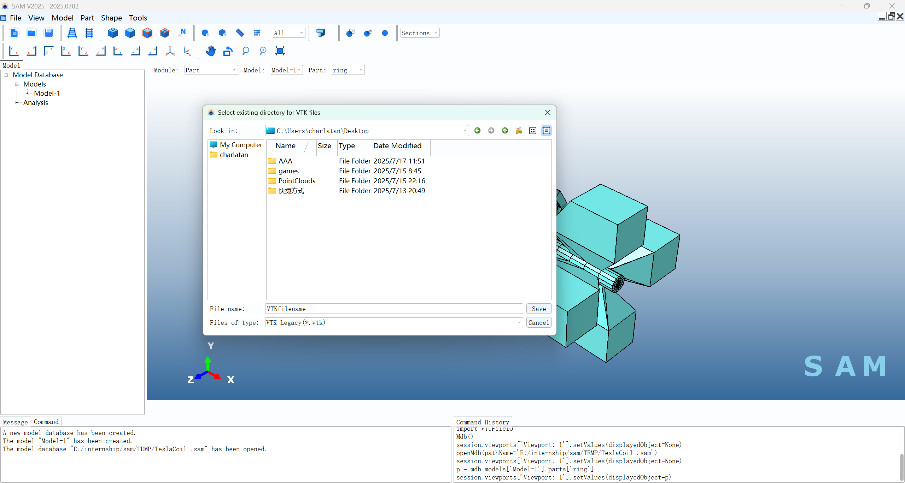
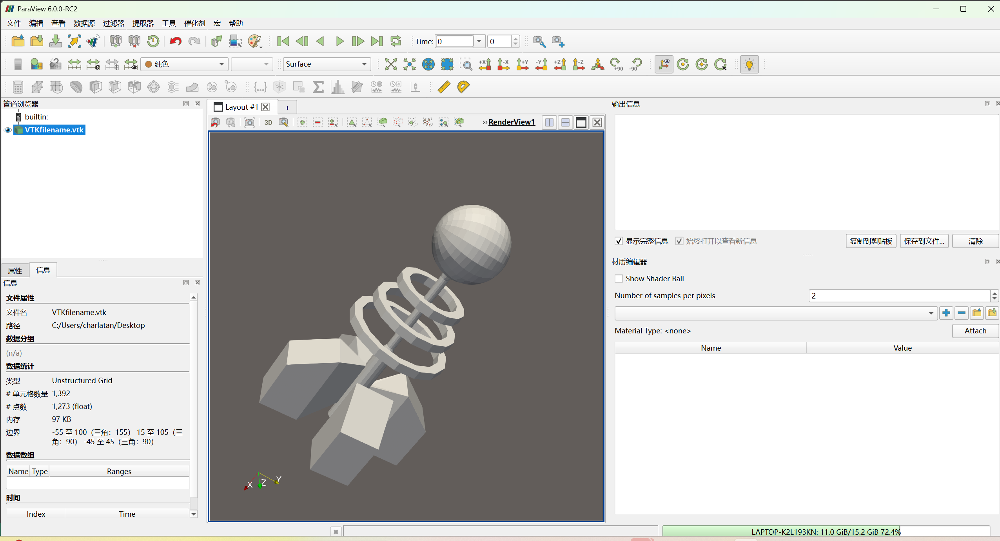

---

# **SAM软件的VTK 文件导入/导出插件用户手册**

**版本：** [1.0.0]

**发布日期：** [2025.7.22]

**适用于 SAM:** [ SAM 2025.7]

---

## **目录**

1.  **简介**
    *   1.1 插件功能概述
    *   1.2 支持的文件格式
    *   1.3 系统要求
2.  **安装**
3.  **使用插件**
    *   3.1 访问插件
    *   3.2 导入 .vtk 文件
    *   3.3 导出 .vtk 文件
4.  **注意事项与限制**
5.  **常见问题 (FAQ)**

---

## **1. 简介**

### **1.1 插件功能概述**
本插件为 SAM 提供了便捷地导入和导出 `VTK Legacy` 格式（扩展名为 `.vtk`) 网格或数据文件的功能。通过两个直观的按钮，用户可以：
*   **导入：** 将外部创建的 `.vtk` 文件加载到 SAM 的模型空间或数据管理中。
*   **导出：** 将当前在 SAM 中选定的模型（网格）导出为 `.vtk` 文件，以便在其他支持该格式的软件（如 ParaView）中进行可视化或进一步处理。

### **1.2 支持的文件格式**
*   **导入：** 支持VTK Legacy **Version 3.0** 及 **Version 5.1** 格式的ASCII `.vtk` 文件导入。
    *   *说明：* 插件支持读取文件中的网格结构为`UNSTRUCTURED_GRID`的VTK文件 。确切的兼容数据结构取决于 SAM 的核心功能。
*   **导出：** 支持将SAM模型导出为VTK Legacy **Version 3.0** 格式的ASCII `.vtk` 文件。
    *   *说明：* 导出功能将当前页面的 SAM 模型网格及节点写入文件。数据类型和表示方式符合 VTK Legacy 3.0 规范。

### **1.3 系统要求**
*   已安装并授权运行 **SAM及兼容版本**。
*   本插件 **VTKFileIO** 已正确安装（见第 2 节）。


---
# **插件安装指南**

## **2. 安装步骤**
1.  **关闭 SAM**  
    确保 SAM 主程序已完全退出。

2.  **定位 SAM 安装目录**  
    * 打开您的 **SAM 安装文件夹**（例如 `C:\Program Files\SAM`）。
    * *注意：实际路径取决于您安装时选择的位置*。

3.  **放置插件文件**  
    **必须严格按以下层级放置**：  
    *   a. 将 **`SAM.Pre.VTUFileIOToolset.dll`**  
        复制到 SAM 安装目录下的：  
        `Release\FilePlugin\` **子文件夹内**  
        *   *完整路径示例*:  
            `C:\Program Files\SAM\Release\FilePlugin\SAM.Pre.VTUFileIOToolset.dll`

    *   b. 将 **`VTUFileIO.pyd`**  
        复制到 SAM 安装目录下的：  
        `Release\` **子文件夹根目录**（与`sam.exe`所在目录同级）  
        *   *完整路径示例*:  
            `C:\Program Files\SAM\Release\VTUFileIO.pyd`

    > 📌 **路径示意图**  
    > ```
    > SAM/
    > └── Release/               ⇠ 核心路径！
    >     ├── FilePlugin/        ⇠ DLL 放置位置
    >     │   └── SAM.Pre.VTUFileIOToolset.dll
    >     └── VTUFileIO.pyd      ⇠ PYD 放置位置
    > 
    > ```

---

## **3. 使用插件**

### **3.1 访问插件**
1.  **启动 SAM。**
2.  **定位插件界面：**
  
    *   菜单： 
    *   点击 `File` -> `Import` -> `Import VTK Part`来导入VTK文件
    *   点击 `File` -> `Export` -> `VTK Legacy ..` 来将SAM模型导出为VTK文件

    


### **3.2 导入 .vtk 文件**
1.  点击 导入导出 按钮或选择相应的菜单项。
2.  系统会弹出标准文件对话框。

3.  浏览并选择你要导入的 `.vtk` 文件 (文件格式需符合 **章节1.2 支持的文件格式** 格式要求)。
4.  点击 `Open`。
5.  插件将执行导入操作。导入后会立即在页面显示图形,主页面左下方Message会输出提示信息

1. 如果网格或数据没有正确显示，请参考 **主页面左下方Message输出提示** 并 **检查文件格式是否符合 章节1.2 支持的文件格式** 格式要求。


### **3.3 导出 .vtk 文件**
1.  点击 `VTK Legacy ..` 按钮来导出模型，该按钮会将 **当前视图** 的模型导出。
2.  系统会弹出标准文件保存对话框。

1.  浏览到你希望保存 `.vtk` 文件的目标目录。
2.  为输出文件输入一个名称（不必输入后缀名）。
3.  点击 `保存`。
4.  插件将执行导出操作，主页面左下方Message窗口将会输出提示
5.  导出后：你可以在目标目录中找到生成的 `.vtk` 文件。可以使用 ParaView、VisIt 等 VTK 兼容软件打开并可视化该文件。
   

---

## **4. 注意事项与限制**
*   **导入兼容性：** 插件仅保证支持标准的 VTK Legacy 3.0 和 5.1 格式。非标准扩展或严重不符合规范以及网格结构非UNSTRUCTURED_GRID的 `.vtk` 文件可能导致导入失败或数据丢失。
*   **导入数据结构：** 插件只能导入 SAM 支持的数据结构（节点、单元类型、数据类型）。如果 `.vtk` 文件包含 SAM 无法识别的数据结构（如特殊单元类型），该部分可能被忽略或转换失败。
*   **导出范围：** 导出操作仅作用于在**当前 SAM 场景** 中的对象 ，如 `Part` 或 `Assembly` 窗口中显示的模型。请务必在导出前选择正确的目标。
*   **导出数据：** 插件导出当前视图中对象的单元及节点。
*   **文件编码：** 仅限 ASCII ，不支持 Binary 格式VTK文件。

---

## **5. 常见问题 (FAQ)**
*   **Q1: 点击导入/导出按钮后没有任何反应？**
    *   A1: 首先确认插件是否已正确安装并激活（见第 2 节）。查看 SAM 的消息窗口或日志文件 是否有错误信息。检查检查文件格式是否符合 **章节1.2** 支持的文件格式要求。
*   **Q2: 导入 .vtk 文件后看不到模型或数据？**
    *   A2: 查看 SAM 的消息窗口或日志文件 是否有错误信息。检查检查文件格式是否符合 **章节1.2** 支持的文件格式要求。
*   **Q3: 导出的 .vtk 文件无法在 ParaView 中打开或显示异常？**
    *   A3: 确认导出的文件是 VTK Legacy **3.0** 格式（插件保证此点）。用文本编辑器打开 `.vtk` 文件开头几行，检查 `# vtk DataFile Version 3.0` 是否存在且文件结构看起来合理（无乱码）。确认在 SAM 导出前正确选择了目标对象（通常是网格模型）。检查是否包含所需的数据字段。
*   **Q4: 可以导入/导出 XYZ 格式或其他变种？**
    *   A4: 本插件**仅**支持标准的 VTK Legacy 3.0/5.1 `.vtk` 格式。不支持其他 VTK 变种（如 XML）、STL、OBJ 或其他格式。
*   **Q5: 导入时能否控制数据字段如何命名或关联？**
    *   A5:  目前不支持在导入过程中重命名字段或修改模型信息。。

---

**附：支持格式总结**

| 操作     | 支持 VTK 格式版本      | 输入/输出 | 备注                                       |
| :------- | :---------------------- | :-------- | :----------------------------------------- |
| **导入** | Legacy **3.0**, **5.1** | 输入      | 读取网格及关联数据                         |
| **导出** | Legacy **3.0**          | 输出      | 导出当前选定对象的网格 |

---
