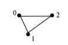
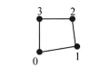
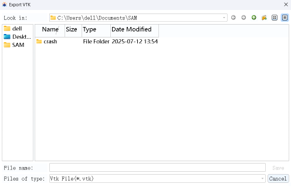

# VTUFileIO 模块

VTUFileIO 模块支持 SAM 网格数据对 VTK 格式数据的导入导出。
目前支持 VTK 文件格式版本:
导入：VTK Legacy 3.0/5.1
导出: VTK Legacy 3.0

## 一、项目结构

<ul style="list-style-type: circle;">
  <li><b>src</b>
    <ul style="list-style-type: circle;">
      <li><b>VTKFileIO</b>
        <ul style="list-style-type: disc;">
          <li>SAMVTKFileIOFragment
          <li>VTUElementHandler
          <li>VTUFileManager
          <li>VTUDataContainer
          <li>VTUContainerWriter
          <li>VTUContainerReader
          <li>FormatIO
          <li>VTKLegacyFormatIO
          <li>MessageHandler
          <li>VTUFileIOPytMoudle
          <li>VTUIOUtils</li>
        </ul>
      </li>
      <li><b>VTKFileIOToolset</b>
        <ul style="list-style-type: disc;">
          <li>VTUFileIODb   /弹窗UI控件
          <li>VTUFileIOForm /弹窗
          <li>VTUFileIOToolsetGui   /SAM按钮控件
          <li>VTUFileIOToolsetPlugin
          <li>VTUIOUtils</li>
        </ul>
      </li>
    </ul>
  </li>
  <li><b>doc</b>
    <ul style="list-style-type: circle;">
      <li>Instruction /项目介绍
      <li>Details   /项目详细设计
      <li>Interfaces    /项目使用的SAM接口
    </ul>
</ul>

## 二、SAM与VTK的文件格式

VTK文件是一种常见的三维图形数据的文件格式，常用于物理模型的建模数据。在CAE软件中，VTK可以支持其后处理数据导出功能，保存其后处理数据如U(位移)，S(Von Mises应力)。

除去**Point**、**Beam**（梁单元，B31）等类型外，SAM支持的单元类型还有**Quad4**(S4R)，**Triangle3**(S3)，**Truss**(T3D2)三种基本单元，与VTK对应如下：

|SAM单元|VTK单元|VTK单元类型编号|
|:--------|:--------|:--------|
|B31|VTK_LINE 3||
|T3D2|VTK_LINE 3||
|S3|VTK_TRIANGLE 5||
|S4R|VTK_QUAD 9||
 
在SAM和VTK中面单元的顶点顺序均为逆时针为正向，保持SAM中单元的`Connectivity`顺序即可保持法向量不变。

## 三、VTK导出功能设计

### 描述

模块读取当前场景视图，将其在用户选择的目录下保存为用户指定名称的VTK文件。界面包括导出按钮及文件资源浏览器UI界面，通过SAM接口和类实现；文件处理使用VTKdev库实现，模块将从SAM中读取模型数据，通过VTKdev库转化为VTK文件支持的格式并写入目标文件中。

### 用户操作流程设计

1. 点击**File**->**Export**->**VTK Legacy..** (未实现，按钮暂存在VTKTest下)；

2. 在弹出文件浏览器选择VTK保存的位置，设置文件名称；

3. 点击Save完成导出，当前视图下的模型将会导出到指定目录下，导出完成信息将在 Message 窗口显示。

### 详细设计

参阅*Details.md*。

## 四、VTK导入功能设计

### 描述

模块读取用户在文件浏览器中选择的VTK文件，通过弹窗选取VTK作为Part插入的位置和名称，读入VTK模型文件。

### 用户操作流程设计

1. 点击**File**->**Import**->**VTK Part** (未实现，按钮暂存在VTKTest下)；

2. 通过文件浏览器窗口选取VTK文件，界面同Export模块，随后导入完成信息将在 Message 窗口显示。

### 详细设计

参阅*Details.md*，。

## 五、额外功能设计

以下是这个项目在允许时间内可能会额外实现的功能，皆为原有功能基础上的拓展，以期获得更好的VTK兼容性和实用功能拓展。

### VTK 版本支持

添加主流 VTK Legacy 版本 VTK3.0 和 VTK5.1 的读写支持。
(目前支持 VTK3.0 读写操作、VTK5.1 读操作)

### VTU支持

`VTU`是 **XML** 化的 **VTK** 文件，相对经典的VTK文件`VTK Legacy`，`VTU`可以支持更多VTK扩展的数据。
需要额外引入QtXml模块
(未实现)

### 批量导出窗口

批量导出设计了一个带复选框的模型树窗口，若工程中包含多个 **Model** 以及多个 **Part** ，批量导出可以帮助将 **Part** 分别输出为单独的 **VTK** 文件。
(未实现)

## 开发日志

